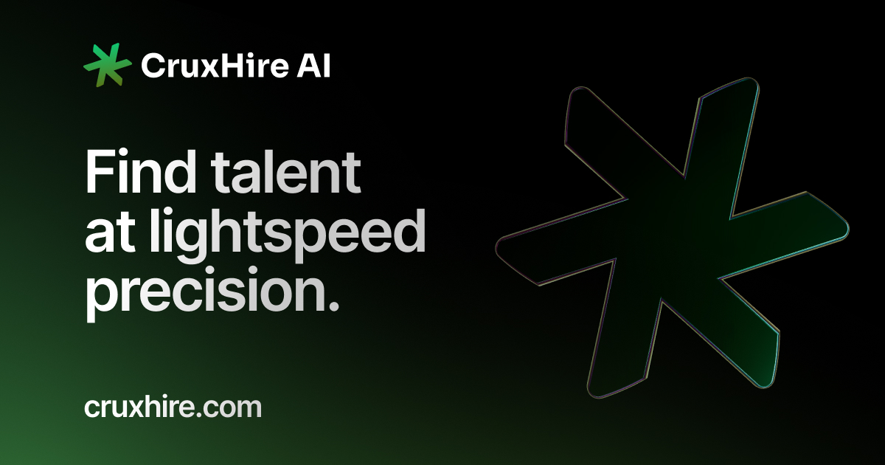

<p align="center" style="margin-top: 20px">
  <p align="center">
    CruxHire AI - Intelligent Recruitment Platform
    <br>
    <a href="https://CruxHire.com"><strong>Get Started »</strong></a>
    <br />
    <br />
    <a href="https://CruxHire.com/about">About</a>
    ·
    <a href="https://CruxHire.com">Website</a>
  </p>
</p>

## About CruxHire AI

CruxHire AI is an intelligent recruitment automation platform that revolutionizes how companies find and manage talent. By leveraging advanced AI technology, we help recruiters and hiring managers save time and never miss out on great candidates. Our platform offers competitive pricing with flexible per-job or monthly subscription options, making professional recruitment tools accessible to businesses of all sizes.

## Key Features

- **Intelligent Job Posting**

  - One-click posting to multiple job boards
  - Automated candidate aggregation from various sources
  - Centralized management dashboard
  - Domain-specific expertise in job post optimization

- **AI-Powered Matching**

  - Automatic candidate-job matching
  - Real-time matching updates when new jobs or candidates are added
  - Smart filtering based on requirements
  - Comprehensive candidate scoring system

- **Recruitment Process Automation**

  - Automated candidate screening and filtering
  - Interview scheduling automation
  - Customizable acceptance/rejection email templates
  - Smart candidate archiving system

- **Centralized Recruitment Hub**

  - All-in-one recruitment dashboard
  - Historical data tracking and analytics
  - Candidate relationship management
  - Team collaboration tools

- **Cost-Effective Solution**
  - Competitive per-job pricing
  - Affordable monthly subscription options
  - Scalable pricing for growing teams
  - No hidden fees

## Tech Stack

<p align="left">
  <a href="https://nextjs.org"></a>
  <a href="https://react.dev"></a>
  <a href="https://www.typescriptlang.org"></a>
  <a href="https://tailwindcss.com"></a>
  <a href="https://www.prisma.io"></a>
</p>

### Frontend

- [Next.js 15](https://nextjs.org/) - React Framework
- [React](https://react.dev/) - UI Library
- [TypeScript](https://www.typescriptlang.org/) - Programming Language
- [Tailwind CSS](https://tailwindcss.com/) - Styling
- [shadcn/ui](https://ui.shadcn.com/) - UI Components

### Backend & Database

- [PostgreSQL](https://www.postgresql.org/) - Database
- [Prisma](https://www.prisma.io/) - ORM
- [OpenAI API](https://openai.com/) - AI Text Analysis
- [PDF.js](https://mozilla.github.io/pdf.js/) - PDF Parsing
- [Auth.js v5](https://authjs.dev/) - Authentication

## Getting Started

### Prerequisites

- Node.js 18+
- PostgreSQL
- OpenAI API key

### Installation

1. Clone the repository:

```bash
git clone https://github.com/yourusername/cvsense-ai.git
```

2. Install dependencies:

```bash
npm install
```

3. Set up environment variables:

```bash
cp .env.example .env
```

4. Initialize the database:

```bash
npx prisma db push
```

5. Start the development server:

```bash
npm run dev
```

## Contributing

This project was developed during VeoHack 2024 by:

- [Team Member 1](https://github.com/member1)
- [Team Member 2](https://github.com/member2)
- [Team Member 3](https://github.com/member3)

## License

This project is licensed under the MIT License - see the [LICENSE](LICENSE) file for details.

## Acknowledgments

- VeoHack 2024 organizers
- [PDF.js](https://mozilla.github.io/pdf.js/)
- [OpenAI](https://openai.com/)

## Tech Stack

<p align="left">
  <a href="https://nextjs.org"></a>
  <a href="https://react.dev"></a>
  <a href="https://www.typescriptlang.org"></a>
  <a href="https://tailwindcss.com"></a>
  <a href="https://www.prisma.io"></a>
</p>

### Frontend

- [Next.js 15](https://nextjs.org/) - React Framework
- [React](https://react.dev/) - UI Library
- [TypeScript](https://www.typescriptlang.org/) - Programming Language
- [Tailwind CSS](https://tailwindcss.com/) - Styling
- [shadcn/ui](https://ui.shadcn.com/) - UI Components

### Backend & Database

- [PostgreSQL](https://www.postgresql.org/) - Database
- [Prisma](https://www.prisma.io/) - ORM
- [Neon](https://neon.tech/) - Serverless Postgres
- [Auth.js v5](https://authjs.dev/) - Authentication
- [Server Actions](https://nextjs.org/docs/app/api-reference/functions/server-actions) - API Endpoints

### Email & Communications

- [Resend](https://resend.com/) - Email Infrastructure
- [React Email](https://react.email/) - Email Templates

## Getting Started

### Prerequisites

- Deno, bun or node.js 18.x or higher

Important:
This project uses `@t3-oss/env-nextjs` for runtime environment variable validation. The validation schema is defined in `env.mjs` and ensures all required environment variables are present with the correct types.

### Required Environment Variables

The following environment variables must be set in your `.env` file:

#### Authentication

- `AUTH_SECRET`: Secret key for authentication
- `GOOGLE_CLIENT_ID`: Google OAuth client ID
- `GOOGLE_CLIENT_SECRET`: Google OAuth client secret
- `AUTH_GITHUB_ID`: GitHub OAuth app ID
- `AUTH_GITHUB_SECRET`: GitHub OAuth app secret

#### Database

- `DATABASE_URL`: PostgreSQL connection string

#### Email

- `RESEND_API_KEY`: API key for Resend email service
- `EMAIL_FROM`: Sender email address

#### AI Services

- `AI_API_KEY`: API key for AI services
- `GROQ_API_KEY`: Groq API key (optional)
- `GROK_API_KEY`: Grok API key (optional)

#### Stripe Integration

- `STRIPE_API_KEY`: Stripe secret key
- `STRIPE_WEBHOOK_SECRET`: Stripe webhook signing secret
- `NEXT_PUBLIC_STRIPE_PRO_MONTHLY_PLAN_ID`: Monthly pro plan ID
- `NEXT_PUBLIC_STRIPE_PRO_YEARLY_PLAN_ID`: Yearly pro plan ID
- `NEXT_PUBLIC_STRIPE_BUSINESS_MONTHLY_PLAN_ID`: Monthly business plan ID
- `NEXT_PUBLIC_STRIPE_BUSINESS_YEARLY_PLAN_ID`: Yearly business plan ID

#### Application URLs

- `NEXT_PUBLIC_APP_URL`: Public URL of your application
- `NEXTAUTH_URL`: Auth.js URL (optional in production)

### Environment Validation

The project uses strict runtime validation for environment variables:

- Server-side variables are validated before the server starts
- Client-side variables are validated during build time
- Type-safe access to environment variables throughout the application
- Helpful error messages if required variables are missing

For production builds, the application uses `.env.production` with dummy values during build time. The actual runtime values are provided by Azure App Service environment variables.

Do not modify `.env.production` with real values as it's committed to the repository.

### Installation

1. Clone the repository:

```sh
git clone https://github.com/Ashref-dev/entretien-ai
```

2. Install dependencies:

```sh
bun install
```

3. Copy the example environment file:

```sh
cp .env.example .env
```

4. Set up your environment variables:

- NEXTAUTH_URL
- NEXTAUTH_SECRET
- NEXT_PUBLIC_APP_URL
- DATABASE_URL
- Etc.

5. Initialize the database:

```sh
bunx prisma db push
```

6. Run the development server:

```sh
bun dev
```

## Deployment

<div style="display: flex; gap: 4px;">


</div>

### This project comes with a ready-to-use Docker configuration and GitHub Actions pipeline for Azure Cloud deployment.

### Docker Support

- Includes a production-ready Dockerfile
- Optimized multi-stage builds for smaller image size
- Configured for Next.js and Bun

### Azure Cloud Deployment

- Pre-configured GitHub Actions workflow for CI/CD
- Automated deployments to Azure App Service
- For detailed deployment commands, see [Deployment Guide](Deployment/commands.md)

To deploy to Azure:

1. Set up an Azure subscription (free with GitHub Student Pack)
2. Install Azure CLI and authenticate
3. Follow the commands in the deployment guide to:
   - Create resource group
   - Set up App Service Plan
   - Configure environment variables
   - Deploy container image

For complete deployment instructions and Azure CLI commands, check our [Deployment Guide](Deployment/commands.md).

# veo-hack
